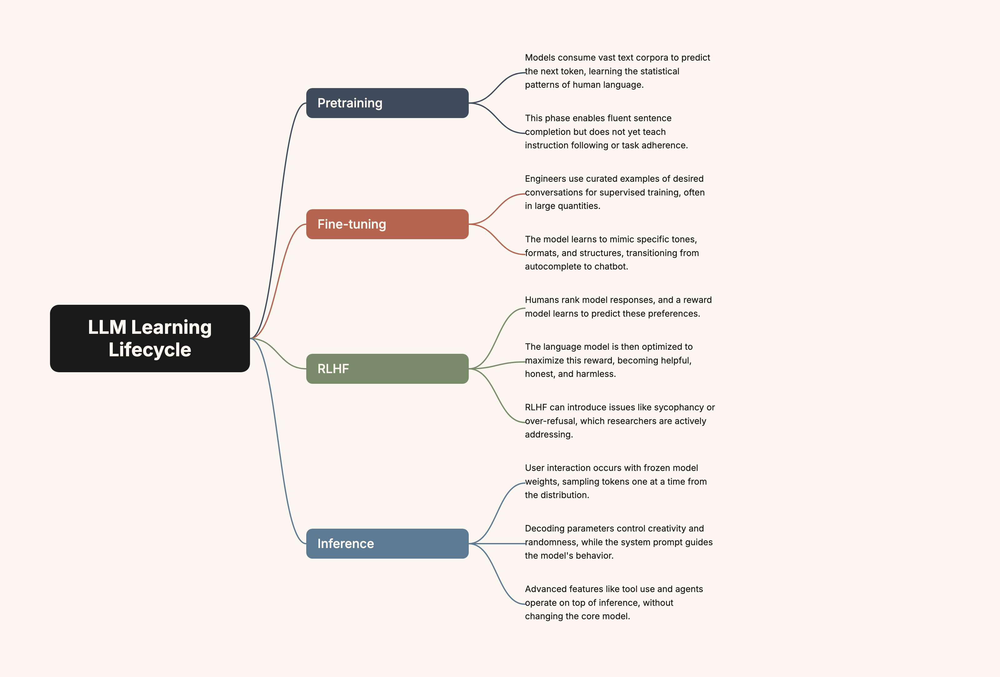

# arbor

Turn a `.txt` file of prose into a horizontal mind-map diagram. SVG, HTML, and PNG, in one shot. Clean, ink-on-paper aesthetic — branches fanning right from a single root, leaf ideas resting at the deepest layer.



The pipeline is small and self-contained:

```
prose.txt
  -> LLM (Gemini by default)        # extract a structured tree
  -> tree.json                      # hand-editable
  -> pure-Python geometry           # branch positions, bezier curves
  -> output.svg / output.html / output.png
```

You can use it as a CLI, or run a small local web portal that handles file upload, live progress, and downloads.

---

## Install

Requires Python 3.11+. Pick a folder, then:

```bash
git clone https://github.com/jstwng/arbor.git
cd arbor

python3.11 -m venv .venv
source .venv/bin/activate

pip install -e .
playwright install chromium       # one-time, used only for PNG screenshots
```

That's it. The first time you run the tool, a config file is created at `~/.config/arbor/config.json`.

---

## Configure

There are two ways to add an API key.

**Easy (recommended): the portal.**

```bash
arbor-portal
# opens http://127.0.0.1:8765
```

If no key is configured, the Settings modal opens automatically. Paste your key in the matching provider row and hit Save. It is written to `~/.config/arbor/config.json` (mode 0600) and never leaves your machine.

**Direct: edit the config file.**

```json
{
  "providers": {
    "gemini": { "api_key": "AIza..." }
  },
  "models": [
    { "id": "gemini-2.5-flash", "label": "Gemini 2.5 Flash", "provider": "gemini", "default": true },
    { "id": "gemini-2.5-pro",   "label": "Gemini 2.5 Pro",   "provider": "gemini" }
  ],
  "themes": [
    { "id": "cream", "label": "Cream", "default": true },
    { "id": "dark",  "label": "Dark"  },
    { "id": "mono",  "label": "Mono"  }
  ],
  "defaults": { "width": 1600 }
}
```

Add or remove models freely — the dropdown in the portal and the `--model` CLI choices follow the config. Ship a fork with whatever defaults make sense for you.

If a `.env` file in your working tree (or any parent directory) holds `GEMINI_API_KEY=...`, it is auto-migrated into the config the first time `arbor` runs.

---

## Use it

### Web portal

```bash
arbor-portal              # http://127.0.0.1:8765
arbor-portal --port 9000  # custom port
```

What you do:

1. Drop a `.txt` file onto the input row, click **Choose file**, or paste an absolute path.
2. Pick theme / model / width (or leave defaults).
3. Hit **Generate**.
4. Watch the diagram build in the preview pane while the status trail ticks through each step.
5. Download `tree.json`, `output.svg`, `output.html`, or `output.png`. The "open in new tab" link gives you the inline browser view.

Each run writes its artifacts to `~/.cache/arbor/<job_id>/`.

### CLI

```bash
arbor notes.txt
arbor notes.txt --theme dark --root "The shape of attention"
arbor notes.txt --model gemini-2.5-pro --width 2000 --out ./out

arbor tree.json --from-tree     # render a hand-edited tree, no API call
```

Flags:

| Flag | Purpose |
|------|---------|
| `--out PATH` | Output directory (default `./out`) |
| `--root "..."` | Override the LLM-chosen root concept |
| `--width N` | Canvas width in pixels (default from config) |
| `--theme cream\|dark\|mono` | Theme id (must exist in config) |
| `--model <id>` | Model id (must exist in config) |
| `--layers N` | Tree depth, 2-5. Layer 1 is the root, layer N is leaves. Default: auto-suggested from input size (2 short, 3 article-length, 4 long-form, 5 book-length). |
| `--from-tree` | Treat the input file as `tree.json`, skip the LLM call |

`--theme` and `--model` choices come from your config, so adding a new model in settings makes it instantly available on the CLI.

### Outputs

Every run produces:

- `tree.json` — the hand-editable intermediate. Tweak it and re-run with `--from-tree`.
- `output.svg` — canonical artifact. Inter font is base64-embedded so the file renders the same on any machine.
- `output.html` — the SVG inside a minimal page wrapper, for browser preview.
- `output.png` — Chromium screenshot at 2x DPI, ready to post.

---

## Adding a new model

Open Settings -> **Add model** -> fill in id, label, provider -> Save. Or edit the config file directly — same shape. The portal dropdown and CLI choices update on the next run.

## Adding a new provider

Today only `gemini` is wired in `src/arbor/extract.py`. Adding another provider means writing one function:

```python
def _extract_<provider>(prose, root_override, model_id, api_key) -> dict:
    # call the SDK, return {"root": "...", "branches": [...]}
```

Then add a branch to `extract_tree`. PRs welcome.

---

## Project layout

```
src/arbor/
  cli.py             # arbor CLI
  server.py          # arbor-portal (FastAPI + SSE)
  config.py          # ~/.config/arbor/config.json + .env migration
  extract.py         # provider-aware tree extraction
  layout.py          # geometry: rects, bezier curves, vertical packing
  render.py          # SVG / HTML / PNG (Playwright at 2x DPI)
  templates/         # Jinja HTML wrapper
  static/            # portal frontend (vanilla HTML/CSS/JS)
  fonts/             # Inter TTFs (bundled, base64-embedded into SVG)
examples/
  sample-prose.txt
  sample-output.{svg,png,json}
docs/superpowers/specs/
  2026-04-22-arbor-design.md
```

---

## License

MIT (see `LICENSE`).

---

made with care by [justin wang](https://jstwng.com) — jstwng.com
